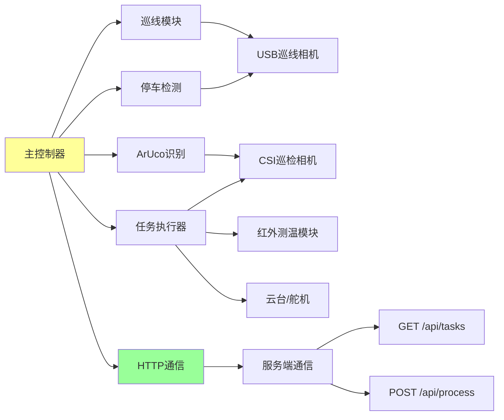
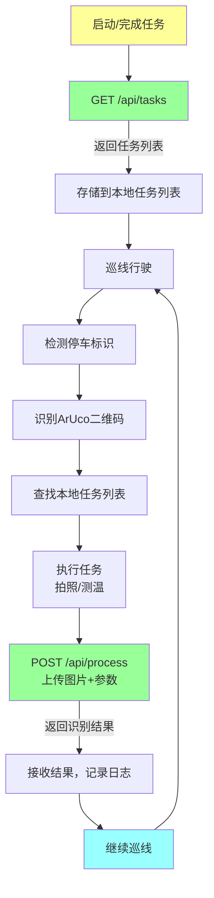

# 智能巡检系统 - 小车端开发文档

## 1. 项目概述

本项目开发一个基于树莓派5的智能巡检小车系统的**小车端（执行端）部分**。小车端负责黑线循迹、站点识别、任务执行和数据采集，将采集的数据上传到服务端进行识别处理。

### 1.1 小车端职责

- 🚗 **自动巡线**: 沿黑色线路自动行驶
- 🛑 **停车识别**: 检测红色停车标识并停车
- 🎯 **站点识别**: 识别ArUco二维码确定站点ID
- 📷 **数据采集**: 拍照和温度采集
- 📡 **数据上传**: 将采集数据上传到服务端
- 🔄 **任务管理**: 维护本地任务列表

### 1.2 小车特点

- 完全自主巡线，无需人工干预
- 本地处理ArUco识别和红外测温
- 网络异常时支持离线模式
- 支持单圈和循环两种运行模式

## 2. 系统架构

### 2.1 小车端架构



### 2.2 与服务端的交互



## 3. 硬件组成

### 3.1 硬件清单

- **树莓派5主控板**: 运行控制程序
- **USB彩色相机**: 黑线循迹和红色停车标识检测
- **CSI相机**: 树莓派Camera Module 3，巡检任务拍照（高分辨率）
- **红外测温模块**: 非接触式温度传感器
- **电机驱动模块**: 控制小车运动
- **云台/舵机**: 调整巡检相机角度
- **电源管理系统**: 供电系统
- **WiFi模块**: 网络通信（树莓派5内置）

### 3.2 硬件要求

- **树莓派5**: 推荐8GB内存版本
- **操作系统**: Raspberry Pi OS (64-bit)
- **Python版本**: 3.11
- **存储**: ≥32GB MicroSD卡
- **网络**: WiFi或以太网，与服务端同一局域网

## 4. 小车端功能需求

### 4.1 核心功能

#### 4.1.1 巡线行驶

**功能描述**: 沿黑色线路自动行驶

**实现要点**:
- 使用USB相机采集路面图像
- 图像处理识别黑线位置
- PID控制算法调整电机速度
- 处理直角弯、锐角弯和十字交叉路口

**关键参数**:

**图像采集**:
- LINE_CAMERA_WIDTH = 640
- LINE_CAMERA_HEIGHT = 480
- LINE_CAMERA_FPS = 30

**黑线检测**:
- BLACK_THRESHOLD = 80（黑线阈值）
- LINE_CENTER_TARGET = 320（目标中心位置）

**PID控制**:
- KP = 1.5（比例系数）
- KI = 0.1（积分系数）
- KD = 0.5（微分系数）
- BASE_SPEED = 100（基础速度）

**算法流程**:
1. 采集路面图像
2. 图像处理（灰度化、二值化）
3. 检测黑线中心位置
4. PID计算偏差修正值
5. 调整左右电机速度
6. 循环执行

#### 4.1.2 停车标识检测

**功能描述**: 识别红色停车标识并立即停车

**实现要点**:
- 在巡线相机图像中检测红色区域
- 判断红色面积和位置
- 检测到停车标识立即刹车
- 执行任务后屏蔽检测3秒（防止重复停车）

**红色检测算法**:
1. 转换图像到HSV色彩空间
2. 设置红色范围阈值（两个范围）
3. 创建红色掩码
4. 计算红色区域面积
5. 判断面积是否超过阈值
6. 返回检测结果

#### 4.1.3 ArUco二维码识别

**功能描述**: 停车后识别站点ArUco二维码（01-99）

**实现要点**:
- 使用CSI巡检相机拍照
- OpenCV ArUco库识别
- 提取站点ID
- 识别失败重试5次

**识别步骤**:
1. 使用OpenCV ArUco库
2. 设置ArUco字典类型（DICT_4X4_50）
3. 创建检测器
4. 循环尝试识别（最多5次）：
   - 使用CSI相机拍照
   - 检测ArUco标记
   - 提取站点ID（1-99范围）
   - 如失败，调整相机角度重试
5. 返回站点ID或识别失败

#### 4.1.4 任务执行

**功能描述**: 根据任务类型执行相应的数据采集

**任务类型处理**:

##### 任务1: 指针仪表拍照 (task_type=1)

**执行步骤**:
1. 读取任务参数中的相机角度
2. 调整舵机到指定角度
3. 等待1秒稳定
4. 使用CSI相机拍照
5. 保存图片到本地
6. 返回图片路径

##### 任务2: 红外测温 (task_type=2)

**执行步骤**:
1. 连续采集5次温度数据
2. 计算最高温度和平均温度
3. 读取环境温度
4. 拍摄热成像图或普通图片
5. 保存图片到本地
6. 构造温度数据字典
7. 返回图片路径和温度数据

##### 任务3/4: 烟雾监测拍照 (task_type=3/4)

**执行步骤**:
1. 读取任务参数中的相机角度
2. 调整舵机到指定角度
3. 等待1秒稳定
4. 使用CSI相机拍照
5. 保存图片到本地
6. 返回图片路径

### 4.2 通信功能

#### 4.2.1 主动拉取任务

**接口**: `GET http://服务端IP:5000/api/tasks`

**触发时机**:
- 小车启动时
- 完成任务后
- 回到起点时
- 无任务时每2秒轮询一次

**实现步骤**:
1. 构造请求URL
2. 发送GET请求到服务端
3. 设置超时时间
4. 检查响应状态码
5. 解析JSON数据
6. 保存任务列表到本地
7. 返回任务列表
8. 异常处理：记录错误日志

**响应处理**:
```json
{
    "status": "success",
    "data": {
        "tasks": [
            {
                "task_id": "uuid-1234",
                "station_id": 3,
                "task_type": 1,
                "params": {
                    "camera_angle": 30,
                    "description": "气压表读数"
                }
            }
        ],
        "count": 1
    },
    "timestamp": "2024-11-21 14:30:00"
}
```

#### 4.2.2 上传任务结果

**接口**: `POST http://服务端IP:3000/api/process`

**触发时机**: 完成数据采集后立即上传

**实现步骤**:
1. 构造API服务URL
2. 准备文件数据（打开图片文件）
3. 准备表单数据（task_type, station_id, params）
4. 使用multipart/form-data格式上传
5. 设置重试机制（最多3次）
6. 发送POST请求
7. 检查响应状态码
8. 解析返回的JSON结果
9. 关闭文件句柄
10. 记录上传日志
11. 返回识别结果

**上传场景说明**:
- **任务1（指针仪表）**: 上传图片 + 相机角度参数
- **任务2（温度检测）**: 上传图片 + 温度数据（max/avg/ambient）
- **任务3/4（烟雾监测）**: 上传图片 + 相机角度参数

### 4.3 本地任务列表管理

**功能**: 维护从服务端获取的任务列表

**数据结构**:
存储在 `local_tasks.json` 文件中，包含：
- tasks: 任务列表数组
- last_update: 最后更新时间

每个任务包含：
- task_id: 任务唯一标识
- station_id: 站点ID
- task_type: 任务类型
- params: 任务参数

**操作接口**:
1. **保存任务列表**: 将任务数组写入JSON文件
2. **加载任务列表**: 从JSON文件读取任务数组
3. **按站点查找**: 遍历查找指定station_id的任务
4. **删除任务**: 从列表中移除指定task_id的任务

### 4.4 模式控制

**单圈模式**:
- 完成所有任务后停止运行
- 适用于一次性巡检

**循环模式**:
- 持续循环巡线
- 每圈结束后重新获取任务
- 适用于长期监控

**实现逻辑**:
- 设置配置变量 RUN_MODE
- 单圈模式：检查任务列表，无任务时停止
- 循环模式：始终继续运行

## 5. 主流程实现

### 5.1 主程序流程

**启动阶段**:
1. 初始化硬件（GPIO、电机、舵机、红外测温）
2. 初始化相机（USB巡线相机、CSI巡检相机）
3. 从服务端获取任务列表

**主循环**:
1. 巡线行驶
2. 检测停车标识
3. 检测到红色标识后停车
4. 识别ArUco二维码获取站点ID
5. 在本地任务列表中查找该站点任务
6. 如无任务，继续前进
7. 如有任务，执行任务采集数据
8. 上传任务结果到服务端
9. 从本地列表删除已完成任务
10. 重置相机角度
11. 重新获取任务列表
12. 继续前进（屏蔽停车检测3秒）
13. 重复循环

**停止阶段**:
- 单圈模式：所有任务完成后停止
- 循环模式：手动停止
- 清理资源（释放相机、清理GPIO）

### 5.2 关键模块说明

**硬件初始化**:
- GPIO模式设置
- 电机驱动初始化
- 舵机控制初始化
- 红外测温模块初始化

**相机初始化**:
- USB巡线相机：设置分辨率和帧率
- CSI巡检相机：配置Picamera2参数

**任务执行分发**:
- 根据task_type路由到对应处理函数
- 任务1：调用指针仪表拍照
- 任务2：调用温度检测
- 任务3/4：调用烟雾监测拍照
- 返回包含图片路径和数据的结果字典

**继续前进控制**:
- 禁用停车检测
- 电机前进固定时间
- 重新启用停车检测

**资源清理**:
- 释放相机资源
- 清理GPIO设置

## 6. 异常处理

### 6.1 网络异常

**场景**: 无法连接服务端

**处理策略**:
1. 失败后等待2秒重试
2. 重试3次仍失败，记录本地日志
3. 继续巡线，下一个站点再次尝试
4. 长时间无法连接进入离线模式

**离线模式实现**:
1. 维护离线模式标志变量
2. 维护离线数据缓存列表
3. 进入离线模式时记录日志
4. 将未上传数据添加到缓存
5. 缓存数据保存到磁盘
6. 网络恢复后逐条同步缓存数据
7. 同步成功后从缓存删除
8. 全部同步完成后退出离线模式

### 6.2 相机故障

**处理策略**:
1. 重新初始化相机
2. 尝试3次，仍失败则跳过该任务
3. 上报故障信息
4. 继续执行其他任务

**安全拍照机制**:
1. 设置最大重试次数（默认3次）
2. 尝试拍照
3. 检查返回结果是否为空
4. 如失败，记录警告日志
5. 重新初始化相机
6. 等待1秒后重试
7. 达到最大次数后返回None

### 6.3 ArUco识别失败

**处理策略**:
1. 调整相机角度重新拍摄
2. 尝试5次
3. 仍失败则记录位置，继续前进

**识别重试机制**:
1. 设置尝试角度列表：[0°, 5°, -5°, 10°, -10°]
2. 循环尝试5次
3. 每次调整舵机到不同角度
4. 等待0.5秒稳定
5. 调用识别函数
6. 识别成功立即返回站点ID
7. 5次全部失败后记录错误日志

### 6.4 停车检测卡死

**处理策略**: 执行完任务后屏蔽检测3秒

**防卡死机制**:
1. 维护停车检测使能标志
2. 记录上次停车时间戳
3. 判断逻辑：
   - 如检测被禁用，返回False
   - 如距上次停车<3秒，返回False
   - 检测到红色标识，更新时间戳，返回True
4. 任务执行后暂时禁用检测
5. 前进一段距离后重新启用

## 7. 配置文件

### 7.1 配置参数说明

**服务端配置**:
- SERVER_IP: 服务端IP地址（需替换为实际IP）
- WEB_PORT: Web服务端口（5000）
- API_PORT: API服务端口（3000）

**巡线相机配置**:
- LINE_CAMERA_WIDTH: 640
- LINE_CAMERA_HEIGHT: 480
- LINE_CAMERA_FPS: 30帧

**巡检相机配置**:
- INSPECTION_WIDTH: 1280
- INSPECTION_HEIGHT: 720
- JPEG_QUALITY: 85

**任务配置**:
- TASK_POLL_INTERVAL: 轮询间隔2秒
- MAX_RETRY: 最大重试3次
- REQUEST_TIMEOUT: 请求超时30秒

**运行模式**:
- RUN_MODE: "循环模式" 或 "单圈模式"

**巡线参数**:
- BLACK_THRESHOLD: 黑线阈值80
- LINE_CENTER_TARGET: 目标中心320
- BASE_SPEED: 基础速度100
- KP: 比例系数1.5
- KI: 积分系数0.1
- KD: 微分系数0.5

**停车检测**:
- RED_AREA_THRESHOLD: 红色面积阈值5000

**文件路径**:
- LOCAL_TASKS_FILE: 本地任务文件
- LOG_FILE: 日志文件
- IMAGE_DIR: 图片目录

## 8. 部署方案

### 8.1 环境准备

```bash
# 更新系统
sudo apt update
sudo apt upgrade -y

# 安装Python依赖
sudo apt install python3-pip python3-opencv python3-picamera2

# 安装Python包
pip3 install requests numpy
```

### 8.2 目录结构

```
RaspiCart/
├── main.py                  # 主程序
├── config.py                # 配置文件
├── modules/
│   ├── line_follow.py       # 巡线模块
│   ├── stop_detect.py       # 停车检测
│   ├── aruco_recognize.py   # ArUco识别
│   ├── task_executor.py     # 任务执行
│   ├── network_client.py    # 网络通信
│   └── motor_control.py     # 电机控制
├── local_tasks.json         # 本地任务列表
├── captured_images/         # 采集的图片
└── logs/
    └── cart.log             # 运行日志
```

### 8.3 启动小车

```bash
# 进入项目目录
cd RaspiCart

# 运行主程序
python3 main.py
```

### 8.4 开机自启动

```bash
# 编辑rc.local
sudo nano /etc/rc.local

# 添加以下内容（在exit 0之前）
cd /home/pi/RaspiCart
python3 main.py &
```

## 9. 测试方案

### 9.1 单元测试

**测试模块**:
1. **ArUco识别测试**: 验证能正确识别站点ID（1-99范围）
2. **温度读取测试**: 验证红外测温读数合理（0-200℃）
3. **网络连接测试**: 验证能成功获取任务列表
4. **巡线功能测试**: 验证黑线检测和PID控制
5. **停车检测测试**: 验证红色标识识别准确性

### 9.2 集成测试

**测试场景**:
1. 巡线行驶稳定性
2. 停车检测准确性
3. ArUco识别成功率
4. 任务执行完整性
5. 网络通信可靠性

### 9.3 实地测试

**测试项目**:
- [ ] 直线巡线测试
- [ ] 弯道巡线测试
- [ ] 十字路口测试
- [ ] 停车精度测试
- [ ] ArUco识别测试（不同光照条件）
- [ ] 任务1完整流程测试
- [ ] 任务2完整流程测试
- [ ] 任务3/4完整流程测试
- [ ] 网络异常恢复测试
- [ ] 长时间运行稳定性测试

## 10. 技术栈

| 技术 | 用途 |
|------|------|
| Python 3.13 | 主编程语言 |
| OpenCV | 巡线、ArUco识别、图像处理 |
| Picamera2 | CSI相机控制 |
| RPi.GPIO | 硬件GPIO控制 |
| requests | HTTP通信 |
| numpy | 数值计算 |

## 11. 常见问题

### Q1: 小车巡线不稳定怎么办？

**答**: 调整PID参数（KP, KI, KD）和黑线阈值（BLACK_THRESHOLD）

### Q2: 停车检测不准确？

**答**: 调整红色阈值和面积阈值，确保光照条件良好

### Q3: ArUco识别失败率高？

**答**: 
- 检查二维码打印质量
- 调整相机焦距
- 改善光照条件
- 增加识别尝试次数

### Q4: 网络连接经常中断？

**答**:
- 检查WiFi信号强度
- 使用有线网络连接
- 启用离线模式

### Q5: 图片上传速度慢？

**答**:
- 降低图片分辨率
- 调整JPEG质量
- 检查网络带宽

## 12. 参考资料

### 12.1 技术文档

- **OpenCV文档**: https://docs.opencv.org/
- **Picamera2文档**: https://datasheets.raspberrypi.com/camera/picamera2-manual.pdf
- **RPi.GPIO文档**: https://sourceforge.net/p/raspberry-gpio-python/wiki/Home/
- **ArUco检测教程**: https://docs.opencv.org/4.x/d5/dae/tutorial_aruco_detection.html

### 12.2 硬件资料

- **树莓派5文档**: https://www.raspberrypi.com/documentation/computers/raspberry-pi-5.html
- **Camera Module 3**: https://www.raspberrypi.com/products/camera-module-3/

---

