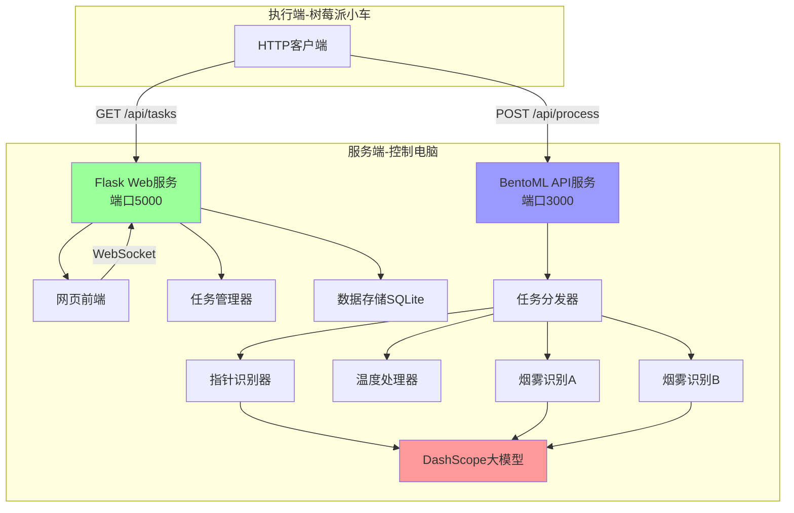
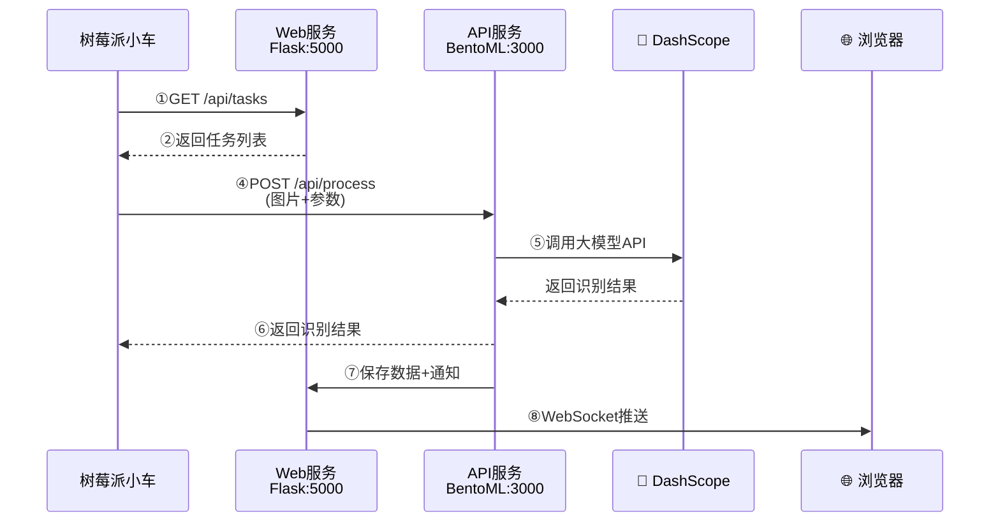

# 智能巡检系统 - 服务端开发文档

## 1. 项目概述

本项目开发一个基于树莓派5的智能巡检小车系统的**服务端部分**。服务端运行在控制电脑上，负责接收小车上传的数据、调用大模型进行识别、提供Web管理界面，实现任务管理和数据可视化功能。

### 1.1 服务端职责

- 🌐 **Web管理服务**: 提供任务管理和实时监控界面
- 🤖 **API识别服务**: 调用多模态大模型进行图像识别
- 📊 **数据管理**: 存储历史数据和图片
- 🔔 **实时推送**: WebSocket实时更新前端显示
- 📋 **任务调度**: 管理任务队列，响应小车请求

### 1.2 服务端特点

- 双服务架构（Flask Web + BentoML API）
- 现代化Web界面，实时监控
- 数据可视化和趋势分析
- 智能报警和音效提示
- 模块化设计，易于扩展

## 2. 系统架构

### 2.1 总体架构



### 2.2 技术架构

```
用户层 (浏览器)
    ↓
Web服务层 (Flask :5000)
├── 静态页面服务 (HTML/CSS/JS)
├── WebSocket实时通信
├── 任务队列管理 (task_queue.json)
└── 历史数据查询 (SQLite)
    ↓
API服务层 (BentoML :3000)
├── 统一路由: /api/process
├── 任务分发器 (根据task_type)
└── 调用DashScope大模型
    ↓
外部服务层
└── 阿里云百炼多模态大模型
```

### 2.3 数据流向



## 3. 硬件要求

### 3.1 服务端计算机

- **操作系统**: Windows 10/11 或 Ubuntu 20.04+
- **CPU**: 4核以上
- **内存**: ≥8GB
- **存储**: ≥50GB可用空间
- **网络**: 与小车在同一局域网

## 4. 服务端功能需求

### 4.1 BentoML API服务 (端口: 3000)

#### 4.1.1 统一处理路由

**接口**: `POST /api/process`

**功能**:
- 接收小车上传的图片和任务参数
- 根据`task_type`字段路由到不同的处理器
- 调用多模态大模型进行视觉识别
- 返回识别结果（JSON格式）

**请求格式**: `multipart/form-data`

| 字段名 | 类型 | 必填 | 说明 |
|--------|------|------|------|
| image | File | 是 | 任务图片（JPEG/PNG） |
| task_type | int | 是 | 任务类型（1-4） |
| station_id | int | 是 | 站点ID |
| params | JSON字符串 | 否 | 额外参数 |

**响应格式**（成功）:
```json
{
    "status": "success",
    "data": {
        "task_type": 1,
        "station_id": 3,
        "result": {
            "value": 1.05,
            "unit": "MPa",
            "confidence": 0.95,
            "status": "normal"
        },
        "processing_time": 1.2,
        "image_saved": true,
        "image_path": "data/images/2024-11-21/task1_station3_143005.jpg"
    },
    "timestamp": "2024-11-21 14:30:05"
}
```

**响应格式**（失败）:
```json
{
    "status": "error",
    "error": {
        "code": "PROCESSING_FAILED",
        "message": "图像识别失败，图片模糊或目标不清晰",
        "details": "低置信度: 0.35"
    },
    "timestamp": "2024-11-21 14:30:05"
}
```

#### 4.1.2 任务处理器实现

##### 任务1: 指针仪表读数 (task_type=1)

**功能**: 识别指针式仪表的读数

**处理流程**:
1. 接收图片
2. 构造专用prompt
3. 调用DashScope大模型
4. 解析返回的JSON结果
5. 保存数据和图片
6. 返回识别结果

**Prompt模板**:
```
请读取这个指针式仪表的数值。

分析步骤：
1. 识别表盘的量程范围（最小值到最大值）
2. 识别表盘的刻度间隔
3. 确定指针的精确位置
4. 计算读数（保留2位小数）

返回格式（纯JSON，无其他文字）：
{
    "value": 读数值,
    "unit": "单位（如MPa、℃等）",
    "min_range": 最小刻度,
    "max_range": 最大刻度,
    "confidence": 置信度(0-1),
    "status": "normal/warning/danger"
}

注意：如果指针不清晰或表盘损坏，confidence设为低值并在status中标注warning
```

**返回结果示例**:
```json
{
    "value": 1.05,
    "unit": "MPa",
    "min_range": 0,
    "max_range": 2.5,
    "confidence": 0.95,
    "status": "normal"
}
```

##### 任务2: 高温物体检测 (task_type=2)

**功能**: 处理温度数据（不调用大模型）

**处理流程**:
1. 接收温度数据和图片
2. 根据温度阈值判断状态
3. 保存数据和图片
4. 返回处理结果

**上传数据格式**:
```json
{
    "task_type": 2,
    "station_id": 5,
    "params": {
        "max_temperature": 85.5,
        "avg_temperature": 45.2,
        "ambient_temperature": 25.0
    }
}
```

**判断逻辑**:
- max_temperature < 60℃ → status = "normal"
- 60℃ ≤ max_temperature < 80℃ → status = "warning"
- max_temperature ≥ 80℃ → status = "danger"

##### 任务3/4: 烟雾判断 (task_type=3/4)

**功能**: 判断监测区域是否存在烟雾

**处理流程**:
1. 接收图片
2. 构造烟雾检测prompt
3. 调用DashScope大模型
4. 解析返回的JSON结果
5. 保存数据和图片
6. 返回判断结果

**Prompt模板**:
```
请分析图片内容，判断其中是否存在烟雾。

烟雾定义：包括但不限于
- 燃烧产生的黑烟、白烟
- 蒸汽、水雾
- 工业排放的烟气
- 任何悬浮在空气中的烟雾状物质

分析要点：
1. 是否有明显的烟雾形态
2. 烟雾的密度（轻微/中等/严重）
3. 烟雾的颜色和分布范围
4. 排除误判（如云、雾霾等自然现象需根据场景判断）

返回格式（纯JSON，无其他文字）：
{
    "has_smoke": true或false,
    "smoke_type": "combustion/steam/fog/none",
    "density": "light/medium/heavy/none",
    "confidence": 置信度(0-1),
    "description": "简短描述"
}
```

### 4.2 Web管理服务 (端口: 5000)

#### 4.2.1 任务管理路由

**接口1**: `GET /api/tasks` - 获取任务列表

**功能**: 提供任务列表给小车查询

**响应格式**:
```json
{
    "status": "success",
    "data": {
        "tasks": [
            {
                "task_id": "uuid-1234",
                "station_id": 3,
                "task_type": 1,
                "params": {
                    "camera_angle": 30,
                    "description": "气压表读数"
                }
            }
        ],
        "count": 2
    },
    "timestamp": "2024-11-21 14:30:00"
}
```

**接口2**: `POST /api/tasks/add` - 添加新任务

**请求格式**:
```json
{
    "station_id": 8,
    "task_type": 1,
    "params": {
        "camera_angle": 30,
        "description": "新增气压表监测点"
    }
}
```

**接口3**: `DELETE /api/tasks/{task_id}` - 删除任务

**接口4**: `GET /api/history` - 获取历史数据

**请求参数**:
- task_type: 任务类型（可选）
- station_id: 站点ID（可选）
- start_date: 开始日期（可选）
- end_date: 结束日期（可选）
- limit: 返回条数（默认50）

#### 4.2.2 WebSocket实时通信

**连接地址**: `ws://服务端IP:5000/ws`

**消息类型**:

1. **新任务结果推送**:
```json
{
    "type": "task_result",
    "data": {
        "task_type": 1,
        "station_id": 3,
        "result": {...},
        "image_url": "/images/..."
    }
}
```

2. **任务队列更新**:
```json
{
    "type": "task_queue_update",
    "data": {
        "tasks": [...],
        "count": 5
    }
}
```

3. **小车状态更新**:
```json
{
    "type": "cart_status",
    "data": {
        "online": true,
        "current_station": 3,
        "mode": "循环模式",
        "battery": 85
    }
}
```

4. **报警推送**:
```json
{
    "type": "alert",
    "data": {
        "level": "danger",
        "message": "检测到高温物体，温度88℃",
        "task_type": 2,
        "station_id": 5
    }
}
```

#### 4.2.3 Web界面功能

**整体布局**:
```
┌─────────────────────────────────────────────────────┐
│  Header Bar: 智能巡检系统 | 🟢 小车在线 | ⚙️ 设置    │
└─────────────────────────────────────────────────────┘
┌──────────┬──────────────────────────────────────────┐
│          │                                          │
│  侧边栏   │         主显示区域（田字格布局）          │
│ (250px)  │                                          │
│          │  ┌───────────┬───────────┐              │
│  任务管理 │  │  任务1    │  任务2    │              │
│  任务队列 │  │ 指针仪表  │ 高温检测   │              │
│  小车状态 │  │ 📈 折线图 │ 📈 温度图 │              │
│  系统日志 │  │ 🖼️ 图片   │ 🖼️ 热成像 │              │
│          │  ├───────────┼───────────┤              │
│          │  │  任务3    │  任务4    │              │
│          │  │ 烟雾监测A │ 烟雾监测B  │              │
│          │  │ 📈 记录   │ 📈 记录   │              │
│          │  │ 🖼️ 图片   │ 🖼️ 图片   │              │
│          │  └───────────┴───────────┘              │
└──────────┴──────────────────────────────────────────┘
```

**侧边栏功能**:

1. **任务管理区域**:
   - 添加新任务按钮
   - 快速选择任务类型（1-4）
   - 输入站点ID
   - 任务统计显示

2. **任务队列区域**:
   - 显示待执行任务列表
   - 每个任务可删除
   - 清空队列功能

3. **小车状态区域**:
   - 在线状态指示
   - 运行模式显示
   - 当前位置
   - 电池电量
   - 最近活动记录

4. **系统日志区域**:
   - 实时日志滚动显示
   - 任务完成记录
   - 警告信息
   - 清空日志功能

**主显示区域（4个任务面板）**:

每个面板包含:
- 📈 **历史数据图表** (ECharts)
  - 折线图显示数据变化趋势
  - X轴：时间
  - Y轴：对应指标值
  - 显示最新/平均/最高/最低值

- 🖼️ **最新图片显示**
  - 显示最新采集的图片
  - 叠加识别结果标注
  - 置信度和状态显示
  - 时间戳

- 🎯 **操作按钮**
  - 查看大图
  - 查看历史记录
  - 导出数据

**设计风格**:
- 深色主题 (#1a1a2e背景 + #0f4c75 accent)
- 毛玻璃效果
- 流畅的动画过渡
- 响应式布局

**智能报警**:
- 根据识别结果自动播放音效
- 异常情况（高温、烟雾）触发报警音
- 正常情况播放提示音
- 使用Web Audio API

## 5. 数据存储设计

### 5.1 SQLite数据库结构

#### 表1: task_records (任务记录表)

```sql
CREATE TABLE task_records (
    id INTEGER PRIMARY KEY AUTOINCREMENT,
    task_id TEXT NOT NULL,
    task_type INTEGER NOT NULL,
    station_id INTEGER NOT NULL,
    image_path TEXT,
    result_data TEXT,                       -- JSON字符串
    status TEXT DEFAULT 'normal',           -- normal/warning/danger
    confidence REAL,
    processing_time REAL,
    timestamp DATETIME DEFAULT CURRENT_TIMESTAMP,
    created_at DATETIME DEFAULT CURRENT_TIMESTAMP
);

CREATE INDEX idx_task_type ON task_records(task_type);
CREATE INDEX idx_station_id ON task_records(station_id);
CREATE INDEX idx_timestamp ON task_records(timestamp);
```

#### 表2: task_queue (任务队列表)

```sql
CREATE TABLE task_queue (
    id INTEGER PRIMARY KEY AUTOINCREMENT,
    task_id TEXT UNIQUE NOT NULL,
    station_id INTEGER NOT NULL,
    task_type INTEGER NOT NULL,
    status TEXT DEFAULT 'pending',          -- pending/assigned/completed/failed
    params TEXT,                            -- JSON
    assigned_at DATETIME,
    completed_at DATETIME,
    created_at DATETIME DEFAULT CURRENT_TIMESTAMP
);

CREATE INDEX idx_status ON task_queue(status);
CREATE INDEX idx_station_task ON task_queue(station_id, task_type);
```

#### 表3: alert_log (报警日志表)

```sql
CREATE TABLE alert_log (
    id INTEGER PRIMARY KEY AUTOINCREMENT,
    record_id INTEGER,
    alert_level TEXT NOT NULL,              -- warning/danger
    alert_type TEXT NOT NULL,
    message TEXT,
    handled BOOLEAN DEFAULT 0,
    timestamp DATETIME DEFAULT CURRENT_TIMESTAMP,
    FOREIGN KEY (record_id) REFERENCES task_records(id)
);

CREATE INDEX idx_alert_level ON alert_log(alert_level);
CREATE INDEX idx_handled ON alert_log(handled);
```

#### 表4: cart_status (小车状态表)

```sql
CREATE TABLE cart_status (
    id INTEGER PRIMARY KEY AUTOINCREMENT,
    online BOOLEAN DEFAULT 1,
    current_station INTEGER,
    mode TEXT DEFAULT 'idle',
    battery_level INTEGER,
    last_activity TEXT,
    timestamp DATETIME DEFAULT CURRENT_TIMESTAMP
);
```

### 5.2 文件系统结构

```
RaspiCartServer/
├── data/
│   ├── database/
│   │   └── inspection.db           # SQLite数据库
│   │
│   ├── images/                     # 图片存储
│   │   ├── 2024-11-21/
│   │   │   ├── task1/              # 按任务类型分类
│   │   │   │   ├── station03_143005.jpg
│   │   │   │   └── station03_143105.jpg
│   │   │   ├── task2/
│   │   │   ├── task3/
│   │   │   └── task4/
│   │   └── 2024-11-22/
│   │
│   ├── logs/
│   │   ├── app.log
│   │   ├── bentoml.log
│   │   └── error.log
│   │
│   └── config/
│       ├── task_queue.json
│       └── system_config.json
│
├── static/                         # 静态资源
│   ├── audio/
│   │   ├── normal.mp3
│   │   ├── warning.mp3
│   │   ├── danger.mp3
│   │   └── task_complete.mp3
│   ├── css/
│   │   ├── style.css
│   │   └── animations.css
│   ├── js/
│   │   ├── main.js
│   │   ├── websocket.js
│   │   ├── charts.js
│   │   └── task_manager.js
│   └── img/
│
└── templates/                      # HTML模板
    ├── index.html
    ├── components/
    │   ├── sidebar.html
    │   ├── task_panel.html
    │   └── modal.html
    └── layouts/
        └── base.html
```

### 5.3 数据清理策略

**自动清理规则**:
- 图片保留30天
- 数据库记录保留90天
- 日志文件保留7天
- 每日凌晨3点执行清理任务

## 6. 异常处理

### 6.1 大模型API异常

**场景**: DashScope API调用失败

**处理策略**:
1. 检查API密钥是否有效
2. 检查网络连接
3. 重试3次（指数退避: 2s, 4s, 8s）
4. 仍失败返回错误信息
5. 记录详细错误日志

**错误响应**:
```json
{
    "status": "error",
    "error": {
        "code": "MODEL_API_ERROR",
        "message": "大模型API调用失败，请稍后重试",
        "retry_after": 10
    }
}
```

### 6.2 图片上传异常

**场景**: 图片文件损坏或格式错误

**处理策略**:
1. 验证图片文件完整性
2. 检查文件格式（JPEG/PNG）
3. 检查文件大小（限制10MB）
4. 无效图片返回错误

### 6.3 数据库异常

**处理策略**:
1. 使用数据库连接池
2. 设置合理的超时时间
3. 定期备份数据库
4. 损坏时从备份恢复

### 6.4 磁盘空间不足

**处理策略**:
1. 监控磁盘使用率
2. 达到80%触发警告
3. 达到90%启动自动清理
4. Web界面显示警告

### 6.5 WebSocket断线

**处理策略**:
1. 自动尝试重连（最多5次）
2. 重连间隔逐渐增加（2s, 4s, 8s...）
3. 显示断线提示
4. 降级到轮询模式

## 7. 性能优化

### 7.1 图片处理优化

**服务端**:
- 接收后创建缩略图 (300x200)
- 原图保存到磁盘
- 缩略图用于Web显示

### 7.2 数据库优化

- 使用索引加速查询
- 定期执行VACUUM清理
- 大量数据分页查询
- 热数据缓存

### 7.3 前端优化

- 图表懒加载
- 图片按需加载
- WebSocket消息防抖
- 使用虚拟滚动

## 8. 部署方案

### 8.1 环境要求

- **操作系统**: Windows 10/11 或 Ubuntu 20.04+
- **Python版本**: 3.10 或 3.11
- **内存**: ≥8GB
- **存储**: ≥50GB
- **网络**: 与小车同一局域网

### 8.2 部署步骤

#### 步骤1: 安装Python环境

```bash
# Windows: 下载Python 3.11安装包并安装

# Linux:
sudo apt update
sudo apt install python3.11 python3.11-venv
```

#### 步骤2: 创建项目目录

```bash
cd D:/code/projects/
cd RaspiCartServer
```

#### 步骤3: 创建虚拟环境

```bash
python -m venv venv

# Windows激活:
venv\Scripts\activate

# Linux激活:
source venv/bin/activate
```

#### 步骤4: 安装依赖

创建 `requirements.txt`:
```
# Web服务
Flask==3.0.0
Flask-SocketIO==5.3.5
Flask-CORS==4.0.0

# API服务
bentoml==1.1.0
pydantic==2.5.0

# 数据处理
numpy==1.24.3
Pillow==10.1.0

# 大模型客户端
openai==1.7.0
python-dotenv==1.0.0

# 工具库
PyYAML==6.0.1
requests==2.31.0
```

安装:
```bash
pip install -r requirements.txt
```

#### 步骤5: 配置环境变量

创建 `.env` 文件:
```
DASHSCOPE_API_KEY=你的阿里云API密钥
DASHSCOPE_BASE_URL=https://dashscope.aliyuncs.com/compatible-mode/v1
```

#### 步骤6: 初始化数据库

```bash
python scripts/init_database.py
```

#### 步骤7: 启动服务

**终端1 - API服务**:
```bash
cd api_server
bentoml serve service.py --port 3000
```

**终端2 - Web服务**:
```bash
cd web_frontend
python app.py
```

### 8.3 访问地址

- **Web管理界面**: `http://服务端IP:5000`
- **API服务**: `http://服务端IP:3000`
- **健康检查**: `http://服务端IP:3000/health`

## 9. 测试方案

### 9.1 API服务测试

**测试内容**:
- 测试指针识别功能
- 测试温度处理功能
- 测试烟雾识别功能
- 验证返回数据格式正确性
- 验证错误处理机制

**测试要点**:
- 使用测试图片验证识别准确率
- 检查响应状态码和数据结构
- 验证大模型API调用是否正常
- 测试异常情况下的错误响应

### 9.2 Web服务测试

**测试内容**:
- 测试获取任务列表接口
- 测试添加任务接口
- 测试删除任务接口
- 测试历史数据查询接口
- 测试WebSocket实时通信

**测试要点**:
- 验证接口返回数据格式
- 检查任务队列管理功能
- 测试前端页面交互
- 验证实时数据推送

### 9.3 性能测试指标

- API响应时间: < 3秒
- 数据库查询: < 100ms
- Web页面加载: < 2秒
- WebSocket延迟: < 500ms

## 10. 技术栈

| 技术 | 用途 |
|------|------|
| Python 3.10/3.11 | 主编程语言 |
| BentoML | API服务框架 |
| Flask | Web服务框架 |
| Flask-SocketIO | WebSocket实时通信 |
| SQLite | 数据库 |
| DashScope API | 多模态大模型 |
| OpenAI SDK | API调用 |
| HTML5/CSS3 | 页面结构和样式 |
| JavaScript (ES6+) | 交互逻辑 |
| ECharts | 数据可视化 |

## 11. 配置文件模板

### 11.1 BentoML config.yaml

```yaml
server:
  host: "0.0.0.0"
  port: 3000
  workers: 4
  timeout: 300

model:
  provider: "dashscope"
  model_name: "qwen-vl-plus"
  temperature: 0.1
  max_tokens: 500
```

### 11.2 Flask配置说明

**基础配置**:
- SECRET_KEY: 密钥配置
- DEBUG: 调试模式开关

**数据库配置**:
- DATABASE_PATH: 数据库文件路径 `data/database/inspection.db`

**文件存储配置**:
- UPLOAD_FOLDER: 图片上传目录 `data/images`
- MAX_CONTENT_LENGTH: 最大文件大小 10MB

**API服务配置**:
- API_SERVICE_URL: BentoML服务地址 `http://localhost:3000`

**WebSocket配置**:
- SOCKETIO_PING_TIMEOUT: 心跳超时 60秒
- SOCKETIO_PING_INTERVAL: 心跳间隔 25秒

**数据清理配置**:
- IMAGE_RETENTION_DAYS: 图片保留天数 30天
- LOG_RETENTION_DAYS: 日志保留天数 7天

## 12. 错误码定义

| 错误码 | 说明 | 处理建议 |
|--------|------|---------|
| NO_TASKS | 无待执行任务 | 正常状态 |
| INVALID_TASK_TYPE | 无效的任务类型 | 检查task_type参数 |
| IMAGE_UPLOAD_FAILED | 图片上传失败 | 检查文件格式和大小 |
| PROCESSING_FAILED | 处理失败 | 记录日志 |
| MODEL_API_ERROR | 大模型API错误 | 检查API密钥和配额 |
| LOW_CONFIDENCE | 识别置信度低 | 要求重新上传 |
| NETWORK_ERROR | 网络连接错误 | 检查网络 |
| SERVER_BUSY | 服务器繁忙 | 稍后重试 |

## 13. 参考资料

### 13.1 技术文档

- **BentoML文档**: https://docs.bentoml.org/
- **Flask文档**: https://flask.palletsprojects.com/
- **ECharts文档**: https://echarts.apache.org/
- **DashScope文档**: https://help.aliyun.com/zh/dashscope/

### 13.2 相关项目

- **BentoML_Server**: D:/code/projects/BentoML_Server
- **LLM_client**: D:/code/projects/LLM_client

---

**文档版本**: v1.0  
**更新日期**: 2024-11-21  
**维护团队**: 服务端开发组

