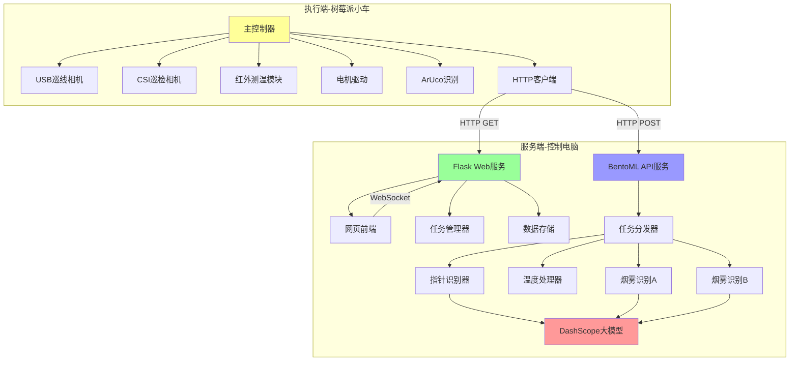
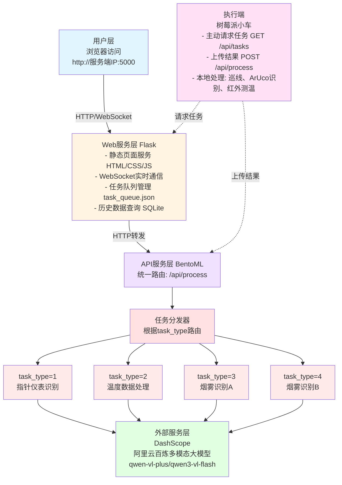
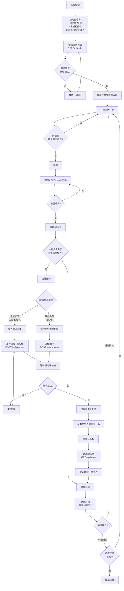
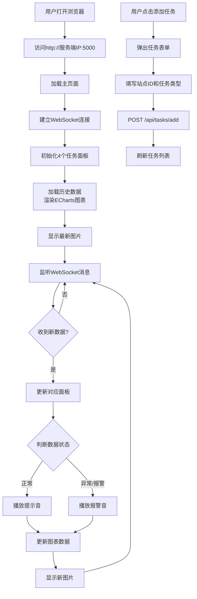

# 智能小车巡检项目需求文档


## 1. 项目概述

本项目开发一个基于树莓派5的智能巡检小车系统，能够在预设的黑色巡线路径上自动行驶，并在指定站点执行巡检任务。系统由执行端（树莓派小车）和服务端（控制电脑）组成，实现自动化巡检、图像识别和任务管理功能。

### 1.1 项目特点

- 🤖 **自动化巡检**: 黑线循迹，自动识别停车点
- 🎯 **智能识别**: 集成多模态大模型进行视觉识别
- 🌐 **Web管理**: 现代化Web界面，实时监控和任务管理
- 📊 **数据可视化**: 历史数据图表展示，趋势分析
- 🔊 **智能报警**: 根据识别结果自动播放报警音
- 🔌 **易于扩展**: 模块化设计，便于添加新任务类型

## 2. 系统架构

### 2.1 总体架构



### 2.2 技术架构



## 3. 硬件组成

### 3.1 执行端硬件
- **树莓派5主控板**: 运行控制程序
- **USB接口彩色相机**: 用于黑线循迹和红色停车标识检测
- **CSI接口相机**: 树莓派Camera Module 3，用于巡检任务拍照（高分辨率）
- **红外测温模块**: 非接触式温度传感器，用于高温物体检测
- **电机驱动模块**: 控制小车运动
- **云台/舵机**: 调整巡检相机角度
- **电源管理系统**: 供电系统
- **WiFi模块**: 网络通信（树莓派5内置）

### 3.2 服务端硬件
- **控制电脑**: 同网段计算机，运行Web服务和API服务
  - 推荐配置: CPU 4核以上, 内存8GB+, 存储空间50GB+
  - 操作系统: Windows 10/11 或 Linux
- **网络设备**: 路由器或交换机，确保小车和服务端在同一局域网

## 4. 软件功能需求

### 4.1 执行端功能（树莓派小车）

#### 4.1.1 核心功能
- **巡线行驶**: 沿黑色线路自动行驶，处理直角弯、锐角弯和十字交叉路口
- **停车标识检测**: 识别红色停车标识并立即停车
- **二维码识别**: 停车后使用巡检相机识别ArUco二维码（范围：01-99）
- **任务执行**: 根据任务类型调整摄像头角度并执行相应采集动作
- **本地任务列表管理**: 维护从服务端获取的任务列表
- **模式控制**: 支持单圈模式和循环模式

#### 4.1.2 通信功能
- **主动拉取任务** (GET请求)
  - 触发时机：启动时、完成任务后、回到起点时
  - 频率：无任务时每2秒询问一次
  - 接口：`GET http://服务端IP:5000/api/tasks`

- **上传任务结果** (POST请求)
  - 触发时机：完成图像采集或数据采集后
  - 接口：`POST http://服务端IP:3000/api/process`
  - 数据：图片 + 任务参数（JSON）

#### 4.1.3 本地处理能力
- **ArUco二维码识别**: 完全在小车端完成，识别站点ID
- **红外测温**: 在小车端完成温度采集和热成像图片获取
- **图像采集**: 根据任务类型拍摄高质量图片

### 4.2 服务端功能

#### 4.2.1 BentoML API服务 (端口: 3000)

**统一处理路由**: `/api/process`
- 接收小车上传的图片和任务参数
- 根据`task_type`字段路由到不同的处理器
- 调用多模态大模型进行视觉识别
- 返回识别结果（JSON格式）

**任务类型处理**:
1. **task_type=1**: 指针仪表值读数（调用大模型）
2. **task_type=2**: 高温数据处理（仅记录，不推理）
3. **task_type=3**: 烟雾判断A（调用大模型）
4. **task_type=4**: 烟雾判断B（调用大模型，复用烟雾识别逻辑）

#### 4.2.2 Web管理服务 (端口: 5000)

**任务管理路由**: `/api/tasks`
- 提供任务列表给小车查询
- 支持通过Web界面添加、修改、删除任务
- 维护任务队列（JSON文件或SQLite）

**Web界面功能**:
- **侧边栏**:
  - 实时连接状态显示
  - 任务队列管理（添加/删除/修改任务）
  - 小车状态监控（当前位置、模式）
  - 系统日志查看
  
- **主显示区（田字格布局）**:
  - 区块1: 指针仪表读数
    - 折线图（ECharts）显示历史数值变化
    - 最新拍摄图片 + 识别结果标注
  - 区块2: 高温检测
    - 温度变化趋势图
    - 热成像图片 + 最高温度显示
  - 区块3: 烟雾监测A
    - 烟雾检测历史记录（有/无）
    - 最新图片 + 检测结果
  - 区块4: 烟雾监测B
    - 烟雾检测历史记录（有/无）
    - 最新图片 + 检测结果

**智能报警**:
- 根据识别结果自动播放相应音效
- 异常情况（高温、烟雾）触发报警音
- 正常情况播放提示音

#### 4.2.3 数据存储功能
- **历史数据库**: SQLite存储所有任务记录
- **图片存储**: 按日期和任务类型分类保存
- **日志系统**: 记录系统运行日志和异常信息

## 5. 系统流程

### 5.1 小车端主流程



### 5.2 服务端处理流程

```mermaid
flowchart TD
    subgraph Web服务-Flask端口5000
        W1[GET /api/tasks请求] --> W2[读取任务队列文件]
        W2 --> W3[返回JSON任务列表]
        
        W4[POST /api/tasks/add] --> W5[添加新任务到队列]
        W5 --> W6[更新任务队列文件]
        W6 --> W7[WebSocket推送更新]
        
        W8[WebSocket连接] --> W9[实时推送任务状态]
        W9 --> W10[更新前端显示]
    end
    
    subgraph API服务-BentoML端口3000
        A1[POST /api/process请求] --> A2[解析multipart数据<br/>图片+JSON参数]
        A2 --> A3{检查task_type}
        
        A3 -->|task_type=1| P1[指针识别处理器]
        A3 -->|task_type=2| P2[温度数据处理器]
        A3 -->|task_type=3| P3[烟雾识别处理器]
        A3 -->|task_type=4| P4[烟雾识别处理器]
        
        P1 --> M1[构造prompt<br/>读取仪表指针位置]
        M1 --> M2[调用DashScope API]
        M2 --> M3[解析返回的JSON结果]
        M3 --> R1[返回识别结果]
        
        P2 --> D1[直接处理温度数据<br/>无需调用大模型]
        D1 --> R2[返回处理结果]
        
        P3 --> M4[构造prompt<br/>判断是否有烟雾]
        P4 --> M4
        M4 --> M5[调用DashScope API]
        M5 --> M6[解析返回的JSON结果]
        M6 --> R3[返回识别结果]
        
        R1 --> S1[保存到数据库]
        R2 --> S1
        R3 --> S1
        S1 --> S2[保存图片到文件系统]
        S2 --> S3[通知Web服务更新]
        S3 --> S4[触发前端刷新]
    end
```



### 5.3 Web前端交互流程



## 6. 任务类型定义

### 6.1 任务类型概览

| 任务ID | 任务名称 | 数据采集方式 | 处理方式 | 大模型调用 |
|--------|---------|-------------|---------|-----------|
| 1 | 指针仪表读数 | CSI相机拍照 | 视觉识别 | ✓ 是 |
| 2 | 高温物体检测 | 红外测温+热成像 | 数据处理 | ✗ 否 |
| 3 | 烟雾判断A | CSI相机拍照 | 视觉识别 | ✓ 是 |
| 4 | 烟雾判断B | CSI相机拍照 | 视觉识别 | ✓ 是 |

### 6.2 任务详细说明

#### 任务1: 指针仪表读数 (task_type=1)

**功能描述**: 识别指针式仪表的读数（如气压表、温度表等）

**数据采集**:
- 小车调整相机角度对准仪表
- 使用CSI相机拍摄高清图片
- 图片分辨率建议: 1920x1080 或 1280x720

**处理流程**:
1. 小车上传图片到 `/api/process`
2. 服务端调用指针识别处理器
3. 构造专用prompt发送给大模型
4. 大模型识别表盘刻度和指针位置
5. 返回读数值和置信度

**Prompt模板**:
```
请读取这个指针式仪表的数值。

分析步骤：
1. 识别表盘的量程范围（最小值到最大值）
2. 识别表盘的刻度间隔
3. 确定指针的精确位置
4. 计算读数（保留2位小数）

返回格式（纯JSON，无其他文字）：
{
    "value": 读数值,
    "unit": "单位（如MPa、℃等）",
    "min_range": 最小刻度,
    "max_range": 最大刻度,
    "confidence": 置信度(0-1),
    "status": "normal/warning/danger"
}

注意：如果指针不清晰或表盘损坏，confidence设为低值并在status中标注warning
```

**返回示例**:
```json
{
    "task_type": 1,
    "station_id": 3,
    "result": {
        "value": 1.05,
        "unit": "MPa",
        "min_range": 0,
        "max_range": 2.5,
        "confidence": 0.95,
        "status": "normal"
    },
    "timestamp": "2024-11-21 14:30:05",
    "processing_time": 1.2
}
```

**报警规则**:
- value超出正常范围 → 播放警告音
- confidence < 0.7 → 提示识别不确定
- status = "danger" → 播放报警音

---

#### 任务2: 高温物体检测 (task_type=2)

**功能描述**: 检测指定位置的温度，判断是否存在高温物体

**数据采集**:
- 小车使用红外测温模块采集温度数据
- 同时拍摄一张热成像图片（如果设备支持）或普通图片
- 采集最高温度值

**处理流程**:
1. 小车端完成温度测量
2. 上传温度数据 + 图片到 `/api/process`
3. 服务端直接处理数据，**不调用大模型**
4. 根据温度阈值判断状态
5. 返回处理结果

**上传数据格式**:
```json
{
    "task_type": 2,
    "station_id": 5,
    "params": {
        "max_temperature": 85.5,
        "avg_temperature": 45.2,
        "ambient_temperature": 25.0
    }
}
```

**返回示例**:
```json
{
    "task_type": 2,
    "station_id": 5,
    "result": {
        "max_temperature": 85.5,
        "avg_temperature": 45.2,
        "status": "warning",
        "message": "检测到高温物体，温度超过阈值"
    },
    "timestamp": "2024-11-21 14:31:00",
    "processing_time": 0.05
}
```

**报警规则**:
- max_temperature < 60℃ → 正常（提示音）
- 60℃ ≤ max_temperature < 80℃ → 警告（警告音）
- max_temperature ≥ 80℃ → 危险（报警音）

---

#### 任务3: 烟雾判断A (task_type=3)

**功能描述**: 判断监测区域A是否存在烟雾

**数据采集**:
- 小车调整相机角度对准监测区域A
- 使用CSI相机拍摄高清图片

**处理流程**:
1. 小车上传图片到 `/api/process`
2. 服务端调用烟雾识别处理器
3. 构造烟雾检测prompt发送给大模型
4. 大模型分析图片中是否存在烟雾
5. 返回判断结果

**Prompt模板**:
```
请分析图片内容，判断其中是否存在烟雾。

烟雾定义：包括但不限于
- 燃烧产生的黑烟、白烟
- 蒸汽、水雾
- 工业排放的烟气
- 任何悬浮在空气中的烟雾状物质

分析要点：
1. 是否有明显的烟雾形态
2. 烟雾的密度（轻微/中等/严重）
3. 烟雾的颜色和分布范围
4. 排除误判（如云、雾霾等自然现象需根据场景判断）

返回格式（纯JSON，无其他文字）：
{
    "has_smoke": true或false,
    "smoke_type": "combustion/steam/fog/none",
    "density": "light/medium/heavy/none",
    "confidence": 置信度(0-1),
    "description": "简短描述"
}
```

**返回示例**:
```json
{
    "task_type": 3,
    "station_id": 7,
    "result": {
        "has_smoke": true,
        "smoke_type": "combustion",
        "density": "medium",
        "confidence": 0.92,
        "description": "检测到中等密度的燃烧烟雾"
    },
    "timestamp": "2024-11-21 14:32:00",
    "processing_time": 1.5
}
```

**报警规则**:
- has_smoke = false → 正常（提示音）
- has_smoke = true 且 density = "light" → 警告（警告音）
- has_smoke = true 且 density = "medium/heavy" → 危险（报警音）

---

#### 任务4: 烟雾判断B (task_type=4)

**功能描述**: 判断监测区域B是否存在烟雾

**说明**: 此任务与任务3完全相同，仅监测区域不同（站点ID不同）

**处理逻辑**: 
- 复用任务3的烟雾识别处理器
- 使用相同的prompt模板
- 使用相同的报警规则
- 数据独立存储和展示

**区别**: 仅在数据库和前端展示时作为独立任务区分

---

### 6.3 任务扩展指南

**添加新任务类型的步骤**:

1. 在任务类型表中添加新ID
2. 在BentoML服务中创建新的处理器类
3. 设计专用的prompt模板（如需大模型）
4. 配置报警规则
5. 在Web前端添加对应的显示面板
6. 更新数据库表结构

**示例场景**:
- 任务5: 液位检测
- 任务6: 设备运行状态识别
- 任务7: 仪表盘指示灯状态
- 任务8: 文字标识识别

## 7. 通信协议设计

### 7.1 通信方式

**协议**: HTTP/1.1  
**数据格式**: JSON + multipart/form-data  
**加密**: 无（演示项目，局域网内通信）  
**认证**: 无  
**超时设置**: 30秒  
**重试策略**: 失败后重试3次，间隔2秒

### 7.2 API路由定义

#### 路由1: 获取任务列表

**接口**: `GET http://服务端IP:5000/api/tasks`

**请求参数**: 无

**响应格式**:
```json
{
    "status": "success",
    "data": {
        "tasks": [
            {
                "task_id": "uuid-1234",
                "station_id": 3,
                "task_type": 1,
                "params": {
                    "camera_angle": 30,
                    "description": "气压表读数"
                }
            },
            {
                "task_id": "uuid-5678",
                "station_id": 5,
                "task_type": 2,
                "params": {
                    "description": "设备温度监测"
                }
            }
        ],
        "count": 2
    },
    "timestamp": "2024-11-21 14:30:00"
}
```

**错误响应**:
```json
{
    "status": "error",
    "error": {
        "code": "NO_TASKS",
        "message": "当前无待执行任务"
    },
    "timestamp": "2024-11-21 14:30:00"
}
```

**调用时机**:
- 小车启动时
- 完成任务后
- 回到起点时
- 无任务待命时每2秒轮询

---

#### 路由2: 提交任务结果（统一处理接口）

**接口**: `POST http://服务端IP:3000/api/process`

**请求方式**: `multipart/form-data`

**请求参数**:

| 字段名 | 类型 | 必填 | 说明 |
|--------|------|------|------|
| image | File | 是 | 任务图片（JPEG/PNG） |
| task_type | int | 是 | 任务类型（1-4） |
| station_id | int | 是 | 站点ID |
| params | JSON字符串 | 否 | 额外参数 |

**task_type=1 请求示例**（指针仪表）:
```
POST /api/process
Content-Type: multipart/form-data

--boundary
Content-Disposition: form-data; name="image"; filename="meter_03.jpg"
Content-Type: image/jpeg

[二进制图片数据]
--boundary
Content-Disposition: form-data; name="task_type"

1
--boundary
Content-Disposition: form-data; name="station_id"

3
--boundary
Content-Disposition: form-data; name="params"

{"camera_angle": 30, "meter_type": "pressure"}
--boundary--
```

**task_type=2 请求示例**（温度检测）:
```
POST /api/process
Content-Type: multipart/form-data

--boundary
Content-Disposition: form-data; name="image"; filename="thermal_05.jpg"
Content-Type: image/jpeg

[热成像图片数据]
--boundary
Content-Disposition: form-data; name="task_type"

2
--boundary
Content-Disposition: form-data; name="station_id"

5
--boundary
Content-Disposition: form-data; name="params"

{
    "max_temperature": 85.5,
    "avg_temperature": 45.2,
    "ambient_temperature": 25.0,
    "measurement_time": "2024-11-21 14:31:00"
}
--boundary--
```

**task_type=3/4 请求示例**（烟雾检测）:
```
POST /api/process
Content-Type: multipart/form-data

--boundary
Content-Disposition: form-data; name="image"; filename="smoke_07.jpg"
Content-Type: image/jpeg

[图片数据]
--boundary
Content-Disposition: form-data; name="task_type"

3
--boundary
Content-Disposition: form-data; name="station_id"

7
--boundary
Content-Disposition: form-data; name="params"

{"area": "A", "camera_angle": 45}
--boundary--
```

**响应格式**（成功）:
```json
{
    "status": "success",
    "data": {
        "task_type": 1,
        "station_id": 3,
        "result": {
            "value": 1.05,
            "unit": "MPa",
            "confidence": 0.95,
            "status": "normal"
        },
        "processing_time": 1.2,
        "image_saved": true,
        "image_path": "data/images/2024-11-21/task1_station3_143005.jpg"
    },
    "timestamp": "2024-11-21 14:30:05"
}
```

**响应格式**（失败）:
```json
{
    "status": "error",
    "error": {
        "code": "PROCESSING_FAILED",
        "message": "图像识别失败，图片模糊或目标不清晰",
        "details": "低置信度: 0.35"
    },
    "timestamp": "2024-11-21 14:30:05"
}
```

---

#### 路由3: 添加新任务（Web管理接口）

**接口**: `POST http://服务端IP:5000/api/tasks/add`

**请求格式**:
```json
{
    "station_id": 8,
    "task_type": 1,
    "params": {
        "camera_angle": 30,
        "description": "新增气压表监测点"
    }
}
```

**响应格式**:
```json
{
    "status": "success",
    "data": {
        "task_id": "uuid-9999",
        "message": "任务添加成功"
    }
}
```

---

#### 路由4: 删除任务（Web管理接口）

**接口**: `DELETE http://服务端IP:5000/api/tasks/{task_id}`

**响应格式**:
```json
{
    "status": "success",
    "data": {
        "message": "任务删除成功"
    }
}
```

---

#### 路由5: 获取历史数据（Web查询接口）

**接口**: `GET http://服务端IP:5000/api/history?task_type=1&limit=50`

**请求参数**:
- task_type: 任务类型（可选）
- station_id: 站点ID（可选）
- start_date: 开始日期（可选）
- end_date: 结束日期（可选）
- limit: 返回条数（默认50）

**响应格式**:
```json
{
    "status": "success",
    "data": {
        "records": [
            {
                "id": 123,
                "task_type": 1,
                "station_id": 3,
                "result": {"value": 1.05, "status": "normal"},
                "timestamp": "2024-11-21 14:30:05",
                "image_path": "data/images/..."
            }
        ],
        "count": 50,
        "total": 150
    }
}
```

---

### 7.3 WebSocket实时通信

**连接地址**: `ws://服务端IP:5000/ws`

**用途**: 服务端主动推送数据更新给Web前端

**消息类型**:

1. **新任务结果推送**:
```json
{
    "type": "task_result",
    "data": {
        "task_type": 1,
        "station_id": 3,
        "result": {...},
        "image_url": "/images/..."
    }
}
```

2. **任务队列更新**:
```json
{
    "type": "task_queue_update",
    "data": {
        "tasks": [...],
        "count": 5
    }
}
```

3. **小车状态更新**:
```json
{
    "type": "cart_status",
    "data": {
        "online": true,
        "current_station": 3,
        "mode": "循环模式",
        "battery": 85
    }
}
```

4. **报警推送**:
```json
{
    "type": "alert",
    "data": {
        "level": "danger",
        "message": "检测到高温物体，温度88℃",
        "task_type": 2,
        "station_id": 5
    }
}
```

---

### 7.4 数据流向图

```
┌─────────────┐                  ┌──────────────┐                 ┌──────────────┐
│  树莓派小车  │                  │  Web服务      │                 │  API服务      │
│  (执行端)   │                  │  Flask:5000  │                 │ BentoML:3000 │
└──────┬──────┘                  └──────┬───────┘                 └──────┬───────┘
       │                                 │                                │
       │ ①GET /api/tasks                │                                │
       ├────────────────────────────────>│                                │
       │                                 │                                │
       │ ②返回任务列表                   │                                │
       │<────────────────────────────────┤                                │
       │                                 │                                │
       │ ③执行任务（拍照/测温）          │                                │
       │                                 │                                │
       │ ④POST /api/process             │                                │
       │ (图片+参数)                     │                                │
       ├─────────────────────────────────────────────────────────────────>│
       │                                 │                                │
       │                                 │  ⑤调用大模型API                │
       │                                 │  (DashScope)                   │
       │                                 │                                ├──> 🤖
       │                                 │                                │<───
       │                                 │                                │
       │ ⑥返回识别结果                   │                                │
       │<─────────────────────────────────────────────────────────────────┤
       │                                 │                                │
       │                                 │ ⑦保存数据+通知更新             │
       │                                 │<───────────────────────────────┤
       │                                 │                                │
       │                                 │ ⑧WebSocket推送                 │
       │                                 ├───────────────> 🌐 Web前端     │
       │                                 │                                │
```

### 7.5 错误码定义

| 错误码 | 说明 | 处理建议 |
|--------|------|---------|
| NO_TASKS | 无待执行任务 | 正常状态，继续轮询 |
| INVALID_TASK_TYPE | 无效的任务类型 | 检查task_type参数 |
| IMAGE_UPLOAD_FAILED | 图片上传失败 | 重试或检查网络 |
| PROCESSING_FAILED | 处理失败 | 记录日志，重新采集 |
| MODEL_API_ERROR | 大模型API错误 | 检查API密钥和配额 |
| LOW_CONFIDENCE | 识别置信度低 | 重新拍摄或人工确认 |
| NETWORK_ERROR | 网络连接错误 | 检查网络连接 |
| SERVER_BUSY | 服务器繁忙 | 稍后重试 |

## 8. Web界面设计

### 8.1 设计风格

**整体风格**: 现代简洁、科技感、炫酷

**颜色方案**:
- 主色调: 深色背景 (#1a1a2e) + 蓝色accent (#0f4c75)
- 强调色: 青色 (#00d4ff)、橙色预警 (#ff6b35)、红色报警 (#e74c3c)
- 文字: 浅灰 (#e0e0e0)、白色标题 (#ffffff)

**设计元素**:
- 毛玻璃效果（frosted glass）
- 微妙阴影和发光效果
- 流畅的过渡动画
- 响应式布局

**参考风格**: 类似控制台界面、科幻UI、Dashboard

### 8.2 布局结构

```
┌─────────────────────────────────────────────────────────────────┐
│  Header Bar (顶部导航栏)                                          │
│  ┌─────────────────────────────────────────────────────────┐    │
│  │ 🚗 智能巡检系统 | 🟢 小车在线 | ⚙️ 设置 | 📊 统计 |  🔔   │    │
│  └─────────────────────────────────────────────────────────┘    │
└─────────────────────────────────────────────────────────────────┘

┌──────────┬──────────────────────────────────────────────────────┐
│          │                                                      │
│  侧边栏   │                    主显示区域                         │
│ (250px)  │                   (田字格布局)                        │
│          │                                                      │
│  ┌────┐  │  ┌──────────────────────┬──────────────────────┐   │
│  │任务│  │  │                      │                      │   │
│  │管理│  │  │   任务1: 指针仪表    │   任务2: 高温检测     │   │
│  └────┘  │  │                      │                      │   │
│          │  │  📈 [折线图]         │  📈 [温度曲线]       │   │
│  ┌────┐  │  │  🖼️ [最新图片]       │  🖼️ [热成像图]       │   │
│  │任务│  │  │                      │                      │   │
│  │队列│  │  ├──────────────────────┼──────────────────────┤   │
│  └────┘  │  │                      │                      │   │
│          │  │   任务3: 烟雾监测A   │   任务4: 烟雾监测B    │   │
│  ┌────┐  │  │                      │                      │   │
│  │小车│  │  │  📈 [状态记录]       │  📈 [状态记录]       │   │
│  │状态│  │  │  🖼️ [最新图片]       │  🖼️ [最新图片]       │   │
│  └────┘  │  │                      │                      │   │
│          │  └──────────────────────┴──────────────────────┘   │
│  ┌────┐  │                                                      │
│  │系统│  │                                                      │
│  │日志│  │                                                      │
│  └────┘  │                                                      │
│          │                                                      │
└──────────┴──────────────────────────────────────────────────────┘
```

### 8.3 侧边栏功能详细

#### 8.3.1 任务管理区域

```
┌─────────────────────────┐
│  📋 任务管理             │
├─────────────────────────┤
│  [+ 添加新任务]          │
│                         │
│  当前任务数: 5          │
│  已完成: 23             │
│  ────────────────       │
│  快速添加:              │
│  ┌──┬──┬──┬──┐        │
│  │1 │2 │3 │4 │        │
│  └──┴──┴──┴──┘        │
│  站点ID: [____]         │
│  [ 提交 ]               │
└─────────────────────────┘
```

**功能**:
- 点击 [+ 添加新任务] 弹出模态框
- 快速选择任务类型（1-4按钮）
- 输入站点ID（01-99）
- 一键提交

**模态框设计**:
```
┌───────────────────────────────────┐
│  添加巡检任务              [✕]    │
├───────────────────────────────────┤
│                                   │
│  站点ID: [03] (01-99)             │
│                                   │
│  任务类型:                         │
│  ○ 指针仪表读数 (1)               │
│  ○ 高温物体检测 (2)               │
│  ● 烟雾判断A (3)                  │
│  ○ 烟雾判断B (4)                  │
│                                   │
│  相机角度: [30]°                  │
│                                   │
│  备注: [____________________]     │
│                                   │
│     [取消]        [确认添加]      │
└───────────────────────────────────┘
```

#### 8.3.2 任务队列区域

```
┌─────────────────────────┐
│  📝 任务队列             │
├─────────────────────────┤
│  站点03 - 类型1  [删除] │
│  ▸ 气压表读数           │
│  状态: 等待执行         │
│  ─────────────────      │
│  站点05 - 类型2  [删除] │
│  ▸ 高温检测             │
│  状态: 等待执行         │
│  ─────────────────      │
│  站点07 - 类型3  [删除] │
│  ▸ 烟雾监测A            │
│  状态: 等待执行         │
│  ─────────────────      │
│  [ 清空队列 ]           │
└─────────────────────────┘
```

#### 8.3.3 小车状态区域

```
┌─────────────────────────┐
│  🚗 小车状态             │
├─────────────────────────┤
│  连接状态: 🟢 在线       │
│  运行模式: 循环模式      │
│  当前位置: 站点03        │
│  电池电量: ████████░ 85% │
│  ─────────────────      │
│  最近活动:              │
│  14:30:05 到达站点03    │
│  14:30:10 执行任务1     │
│  14:30:15 上传完成      │
└─────────────────────────┘
```

#### 8.3.4 系统日志区域

```
┌─────────────────────────┐
│  📜 系统日志 [清空]      │
├─────────────────────────┤
│  14:30:15 ✓ 任务完成    │
│  站点03-指针读数: 1.05  │
│  ─────────────────      │
│  14:29:45 ⚠️ 警告       │
│  站点05-温度过高: 85℃   │
│  ─────────────────      │
│  14:28:30 ✓ 任务完成    │
│  站点07-无烟雾          │
│  ─────────────────      │
│  [查看更多...]          │
└─────────────────────────┘
```

### 8.4 主显示区域（田字格面板）

每个任务面板的结构:

```
┌──────────────────────────────────────────┐
│  📊 任务1: 指针仪表读数      [最小化] [⚙️] │
├──────────────────────────────────────────┤
│  ┌────────────────────────────────────┐  │
│  │  历史数据图表 (ECharts)             │  │
│  │  ┌──────────────────────────────┐  │  │
│  │  │   📈 仪表读数变化曲线          │  │  │
│  │  │   Y轴: 读数值 (MPa)           │  │  │
│  │  │   X轴: 时间                   │  │  │
│  │  │   ─────────────               │  │  │
│  │  │     ╱╲  ╱╲                    │  │  │
│  │  │    ╱  ╲╱  ╲                   │  │  │
│  │  │   ╱         ╲                 │  │  │
│  │  │                               │  │  │
│  │  └──────────────────────────────┘  │  │
│  │  最新: 1.05 MPa  |  平均: 1.02    │  │
│  │  最高: 1.15      |  最低: 0.95    │  │
│  └────────────────────────────────────┘  │
│                                           │
│  ┌────────────────────────────────────┐  │
│  │  最新图片显示                       │  │
│  │  ┌──────────────────────────────┐  │  │
│  │  │                              │  │  │
│  │  │      [仪表图片]               │  │  │
│  │  │                              │  │  │
│  │  │   ┌────────────────────┐    │  │  │
│  │  │   │ 读数: 1.05 MPa     │    │  │  │
│  │  │   │ 状态: ✓ 正常       │    │  │  │
│  │  │   │ 置信度: 95%        │    │  │  │
│  │  │   │ 时间: 14:30:05     │    │  │  │
│  │  │   └────────────────────┘    │  │  │
│  │  │                              │  │  │
│  │  └──────────────────────────────┘  │  │
│  │  [查看大图] [历史记录] [导出数据]  │  │
│  └────────────────────────────────────┘  │
└──────────────────────────────────────────┘
```

**面板特效**:
- 鼠标悬停：边框发光（cyan）
- 数据更新：脉冲动画
- 异常报警：边框闪烁（红色）
- 背景：半透明毛玻璃效果

### 8.5 动画效果

1. **数据更新动画**:
   - 新数据到达时，数字从旧值平滑过渡到新值
   - 图表新增数据点时带入场动画

2. **报警动画**:
   - 异常面板边框呼吸灯效果（红色/橙色）
   - 标题栏闪烁提示
   - 配合音效播放

3. **加载动画**:
   - 骨架屏（Skeleton Screen）
   - 旋转加载指示器

4. **过渡动画**:
   - 侧边栏展开/收起：滑动
   - 模态框：淡入淡出
   - 面板切换：翻转效果

### 8.6 响应式设计

**大屏幕 (≥1920px)**:
- 田字格布局，4个面板平铺
- 侧边栏固定250px

**中等屏幕 (1280-1919px)**:
- 田字格布局，面板略小
- 侧边栏可收起

**小屏幕 (768-1279px)**:
- 2x2布局，面板纵向排列
- 侧边栏悬浮

**移动端 (<768px)**:
- 单列布局
- 侧边栏抽屉式

---

## 9. 数据存储设计

### 9.1 SQLite数据库结构

#### 表1: task_records (任务记录表)

```sql
CREATE TABLE task_records (
    id INTEGER PRIMARY KEY AUTOINCREMENT,
    task_id TEXT NOT NULL,                  -- 任务UUID
    task_type INTEGER NOT NULL,             -- 任务类型 (1-4)
    station_id INTEGER NOT NULL,            -- 站点ID
    image_path TEXT,                        -- 图片保存路径
    result_data TEXT,                       -- 识别结果 (JSON字符串)
    status TEXT DEFAULT 'normal',           -- normal/warning/danger
    confidence REAL,                        -- 置信度
    processing_time REAL,                   -- 处理耗时(秒)
    timestamp DATETIME DEFAULT CURRENT_TIMESTAMP,  -- 时间戳
    created_at DATETIME DEFAULT CURRENT_TIMESTAMP
);

-- 索引
CREATE INDEX idx_task_type ON task_records(task_type);
CREATE INDEX idx_station_id ON task_records(station_id);
CREATE INDEX idx_timestamp ON task_records(timestamp);
```

#### 表2: task_queue (任务队列表)

```sql
CREATE TABLE task_queue (
    id INTEGER PRIMARY KEY AUTOINCREMENT,
    task_id TEXT UNIQUE NOT NULL,           -- 任务UUID
    station_id INTEGER NOT NULL,            -- 站点ID
    task_type INTEGER NOT NULL,             -- 任务类型
    status TEXT DEFAULT 'pending',          -- pending/assigned/completed/failed
    params TEXT,                            -- 任务参数 (JSON)
    assigned_at DATETIME,                   -- 分配时间
    completed_at DATETIME,                  -- 完成时间
    created_at DATETIME DEFAULT CURRENT_TIMESTAMP
);

-- 索引
CREATE INDEX idx_status ON task_queue(status);
CREATE INDEX idx_station_task ON task_queue(station_id, task_type);
```

#### 表3: alert_log (报警日志表)

```sql
CREATE TABLE alert_log (
    id INTEGER PRIMARY KEY AUTOINCREMENT,
    record_id INTEGER,                      -- 关联task_records.id
    alert_level TEXT NOT NULL,              -- warning/danger
    alert_type TEXT NOT NULL,               -- 报警类型
    message TEXT,                           -- 报警信息
    handled BOOLEAN DEFAULT 0,              -- 是否已处理
    timestamp DATETIME DEFAULT CURRENT_TIMESTAMP,
    FOREIGN KEY (record_id) REFERENCES task_records(id)
);

-- 索引
CREATE INDEX idx_alert_level ON alert_log(alert_level);
CREATE INDEX idx_handled ON alert_log(handled);
```

#### 表4: cart_status (小车状态表)

```sql
CREATE TABLE cart_status (
    id INTEGER PRIMARY KEY AUTOINCREMENT,
    online BOOLEAN DEFAULT 1,               -- 是否在线
    current_station INTEGER,                -- 当前站点
    mode TEXT DEFAULT 'idle',               -- idle/running/charging
    battery_level INTEGER,                  -- 电池电量 (%)
    last_activity TEXT,                     -- 最后活动描述
    timestamp DATETIME DEFAULT CURRENT_TIMESTAMP
);
```

### 9.2 文件系统结构

```
RaspiCartServer/
├── data/
│   ├── database/
│   │   └── inspection.db           # SQLite数据库
│   │
│   ├── images/                     # 图片存储
│   │   ├── 2024-11-21/
│   │   │   ├── task1/              # 按任务类型分类
│   │   │   │   ├── station03_143005.jpg
│   │   │   │   └── station03_143105.jpg
│   │   │   ├── task2/
│   │   │   │   ├── station05_143100.jpg
│   │   │   │   └── station05_thermal.jpg
│   │   │   ├── task3/
│   │   │   └── task4/
│   │   └── 2024-11-22/
│   │
│   ├── logs/                       # 日志文件
│   │   ├── app.log                 # 应用日志
│   │   ├── bentoml.log             # API服务日志
│   │   └── error.log               # 错误日志
│   │
│   └── config/
│       ├── task_queue.json         # 任务队列 (JSON缓存)
│       └── system_config.json      # 系统配置
│
├── static/                         # 静态资源
│   ├── audio/                      # 音频文件
│   │   ├── normal.mp3              # 正常提示音
│   │   ├── warning.mp3             # 警告音
│   │   ├── danger.mp3              # 危险报警音
│   │   └── task_complete.mp3      # 任务完成音
│   │
│   ├── css/
│   │   ├── style.css               # 主样式
│   │   └── animations.css          # 动画样式
│   │
│   ├── js/
│   │   ├── main.js                 # 主逻辑
│   │   ├── websocket.js            # WebSocket处理
│   │   ├── charts.js               # 图表渲染
│   │   └── task_manager.js         # 任务管理
│   │
│   └── img/
│       ├── icons/                  # 图标
│       └── placeholders/           # 占位图
│
└── templates/                      # HTML模板
    ├── index.html                  # 主页
    ├── components/
    │   ├── sidebar.html            # 侧边栏组件
    │   ├── task_panel.html         # 任务面板组件
    │   └── modal.html              # 模态框组件
    └── layouts/
        └── base.html               # 基础布局
```

### 9.3 数据清理策略

**自动清理规则**:
- 图片保留30天，超期自动删除
- 数据库记录保留90天
- 日志文件保留7天
- 每日凌晨3点执行清理任务

**手动清理**:
- Web界面提供"清理数据"功能
- 可选择性清理指定日期范围的数据

---

## 10. 异常处理

### 10.1 小车端异常

#### 10.1.1 网络异常
**场景**: 无法连接服务端

**处理策略**:
1. 失败后等待2秒重试
2. 重试3次仍失败，记录本地日志
3. 继续巡线，下一个站点再次尝试
4. 如长时间无法连接，进入离线模式

**离线模式**:
- 继续执行本地已存任务
- 数据缓存到本地
- 恢复连接后批量上传

#### 10.1.2 相机故障
**场景**: 相机无法拍照

**处理策略**:
1. 重新初始化相机
2. 尝试3次，仍失败则跳过该任务
3. 上报故障信息到服务端
4. 继续执行其他任务

#### 10.1.3 ArUco识别失败
**场景**: 无法识别站点二维码

**处理策略**:
1. 调整相机角度重新拍摄
2. 尝试5次
3. 仍失败则记录位置，继续前进
4. 等待人工干预

#### 10.1.4 停车检测卡死
**场景**: 反复检测到停车标识

**处理策略**:
1. 执行完任务后，屏蔽检测3秒
2. 记录该站点状态
3. 强制继续前进
4. 避免死循环

### 10.2 服务端异常

#### 10.2.1 大模型API异常
**场景**: DashScope API调用失败

**处理策略**:
1. 检查API密钥是否有效
2. 检查网络连接
3. 重试3次（指数退避）
4. 仍失败返回错误信息给小车
5. 记录详细错误日志

**错误响应示例**:
```json
{
    "status": "error",
    "error": {
        "code": "MODEL_API_ERROR",
        "message": "大模型API调用失败，请稍后重试",
        "retry_after": 10
    }
}
```

#### 10.2.2 图片上传异常
**场景**: 图片文件损坏或格式错误

**处理策略**:
1. 验证图片文件完整性
2. 检查文件格式（JPEG/PNG）
3. 检查文件大小（限制10MB）
4. 无效图片返回错误，要求重新上传

#### 10.2.3 数据库异常
**场景**: SQLite数据库锁死或损坏

**处理策略**:
1. 使用数据库连接池
2. 设置合理的超时时间
3. 定期备份数据库
4. 损坏时从备份恢复

#### 10.2.4 磁盘空间不足
**场景**: 存储空间即将用尽

**处理策略**:
1. 监控磁盘使用率
2. 达到80%时触发警告
3. 达到90%时启动自动清理
4. 清理最旧的图片和日志
5. Web界面显示警告信息

### 10.3 前端异常

#### 10.3.1 WebSocket断线
**场景**: 实时连接中断

**处理策略**:
1. 自动尝试重连（最多5次）
2. 每次重连间隔逐渐增加（2s, 4s, 8s...）
3. 显示断线提示
4. 降级到轮询模式

#### 10.3.2 图表渲染失败
**场景**: ECharts初始化失败

**处理策略**:
1. 检查数据格式
2. 降级到简单表格显示
3. 记录错误日志

---

## 11. 性能优化

### 11.1 图片处理优化

**小车端**:
- 拍照分辨率：1280x720 (高质量) 或 640x480 (快速模式)
- JPEG质量：85%
- 上传前压缩

**服务端**:
- 接收后创建缩略图 (300x200)
- 原图保存到磁盘
- 缩略图用于Web显示

### 11.2 数据库优化

- 使用索引加速查询
- 定期执行VACUUM清理
- 大量数据分页查询
- 热数据缓存到Redis（可选）

### 11.3 前端优化

- 图表懒加载
- 图片按需加载
- WebSocket消息防抖
- 使用虚拟滚动（大数据列表）

---

## 12. 部署方案

### 12.1 环境要求

#### 服务端计算机
- **操作系统**: Windows 10/11 或 Ubuntu 20.04+
- **Python版本**: 3.10 或 3.11
- **内存**: ≥8GB
- **存储**: ≥50GB可用空间
- **网络**: 与小车同一局域网

#### 树莓派小车
- **型号**: 树莓派5
- **操作系统**: Raspberry Pi OS (64-bit)
- **Python版本**: 3.11
- **网络**: WiFi或以太网连接

### 12.2 服务端部署步骤

#### 步骤1: 安装Python环境

```bash
# Windows
下载Python 3.11安装包并安装

# Linux
sudo apt update
sudo apt install python3.11 python3.11-venv
```

#### 步骤2: 创建项目目录

```bash
cd D:/code/projects/
git clone [项目仓库] RaspiCartServer
cd RaspiCartServer
```

#### 步骤3: 创建虚拟环境

```bash
python -m venv venv
# Windows激活
venv\Scripts\activate
# Linux激活
source venv/bin/activate
```

#### 步骤4: 安装依赖

创建 `requirements.txt`:
```
# Web服务
Flask==3.0.0
Flask-SocketIO==5.3.5
Flask-CORS==4.0.0

# API服务
bentoml==1.1.0
pydantic==2.5.0

# 数据处理
numpy==1.24.3
Pillow==10.1.0

# 数据库
sqlite3  # Python标准库

# 大模型客户端
openai==1.7.0
python-dotenv==1.0.0

# 工具库
PyYAML==6.0.1
requests==2.31.0
```

安装:
```bash
pip install -r requirements.txt
```

#### 步骤5: 配置环境变量

创建 `.env` 文件:
```
DASHSCOPE_API_KEY=你的阿里云API密钥
DASHSCOPE_BASE_URL=https://dashscope.aliyuncs.com/compatible-mode/v1
```

#### 步骤6: 初始化数据库

```bash
python scripts/init_database.py
```

#### 步骤7: 启动服务

终端1 - API服务:
```bash
cd api_server
bentoml serve service.py --port 3000
```

终端2 - Web服务:
```bash
cd web_frontend
python app.py
```

### 12.3 访问地址

- **Web管理界面**: `http://服务端IP:5000`
- **API服务**: `http://服务端IP:3000`
- **健康检查**: `http://服务端IP:3000/health`

### 12.4 配置小车连接

在小车端配置文件中设置服务端地址:
```python
# config.py
SERVER_IP = "192.168.1.100"  # 替换为实际服务端IP
WEB_PORT = 5000
API_PORT = 3000
```

---

## 13. 开发计划

### 13.1 开发阶段

#### 阶段1: 基础框架搭建 (1周)

**任务**:
- [ ] 创建项目目录结构
- [ ] 配置Python虚拟环境
- [ ] 初始化Git仓库
- [ ] 搭建BentoML API服务框架
- [ ] 搭建Flask Web服务框架
- [ ] 创建SQLite数据库和表结构

**产出**:
- 项目骨架
- 可运行的基础服务
- 数据库初始化脚本

#### 阶段2: API服务开发 (1-2周)

**任务**:
- [ ] 实现统一处理路由 `/api/process`
- [ ] 开发任务1处理器（指针识别）
- [ ] 开发任务2处理器（温度处理）
- [ ] 开发任务3/4处理器（烟雾识别）
- [ ] 集成DashScope大模型API
- [ ] 实现错误处理和日志记录
- [ ] 编写单元测试

**产出**:
- 完整的API服务
- 测试用例
- API文档

#### 阶段3: Web服务开发 (2周)

**任务**:
- [ ] 实现任务管理路由 (`/api/tasks`)
- [ ] 实现历史数据查询路由
- [ ] 实现WebSocket实时通信
- [ ] 开发前端HTML/CSS/JS
- [ ] 实现田字格布局
- [ ] 集成ECharts图表
- [ ] 实现音频报警功能
- [ ] 实现侧边栏任务管理
- [ ] 响应式设计优化

**产出**:
- 完整的Web管理界面
- 前端组件库
- 用户使用文档

#### 阶段4: 小车端开发 (2周)

**任务**:
- [ ] 实现巡线控制
- [ ] 实现停车标识检测
- [ ] 实现ArUco二维码识别
- [ ] 实现相机拍照功能
- [ ] 实现红外测温采集
- [ ] 实现HTTP通信模块
- [ ] 实现任务执行逻辑
- [ ] 实现异常处理

**产出**:
- 小车控制程序
- 通信模块
- 测试脚本

#### 阶段5: 联调测试 (1周)

**任务**:
- [ ] 搭建测试环境
- [ ] 小车与服务端联调
- [ ] 端到端功能测试
- [ ] 性能测试
- [ ] 压力测试
- [ ] Bug修复

**产出**:
- 测试报告
- Bug清单和修复记录

#### 阶段6: 优化和文档 (1周)

**任务**:
- [ ] 性能优化
- [ ] UI/UX优化
- [ ] 编写使用文档
- [ ] 编写部署文档
- [ ] 录制演示视频
- [ ] 准备演示PPT

**产出**:
- 完整的项目文档
- 演示材料
- 部署指南

### 13.2 里程碑

| 时间节点 | 里程碑 | 交付物 |
|---------|--------|--------|
| 第1周末 | 框架搭建完成 | 可运行的基础服务 |
| 第3周末 | API服务完成 | 完整的识别API |
| 第5周末 | Web界面完成 | 可用的管理界面 |
| 第7周末 | 小车程序完成 | 可运行的小车端 |
| 第8周末 | 联调完成 | 系统整体可用 |
| 第9周末 | 项目交付 | 完整项目+文档 |

### 13.3 风险评估

| 风险项 | 可能性 | 影响 | 应对措施 |
|--------|-------|------|---------|
| 大模型API调用失败 | 中 | 高 | 准备备用模型，增加重试机制 |
| 网络不稳定 | 高 | 中 | 实现离线模式，数据缓存 |
| 小车硬件故障 | 中 | 高 | 准备备用硬件，模块化设计 |
| 识别准确率低 | 中 | 中 | 优化prompt，增加置信度判断 |
| 开发时间不足 | 中 | 高 | 分阶段交付，核心功能优先 |

---

## 14. 测试方案

### 14.1 单元测试

**API服务测试**:
```python
# test_api_service.py
def test_pointer_recognition():
    """测试指针识别"""
    with open("test_images/meter.jpg", "rb") as f:
        response = client.post("/api/process", 
            data={
                "task_type": 1,
                "station_id": 3,
                "image": f
            }
        )
    assert response.status_code == 200
    assert "value" in response.json()["data"]["result"]

def test_temperature_processing():
    """测试温度处理"""
    response = client.post("/api/process",
        data={
            "task_type": 2,
            "station_id": 5,
            "params": json.dumps({
                "max_temperature": 85.5
            })
        }
    )
    assert response.status_code == 200
```

**Web服务测试**:
```python
# test_web_service.py
def test_get_tasks():
    """测试获取任务列表"""
    response = client.get("/api/tasks")
    assert response.status_code == 200
    assert "tasks" in response.json()["data"]

def test_add_task():
    """测试添加任务"""
    response = client.post("/api/tasks/add",
        json={
            "station_id": 8,
            "task_type": 1
        }
    )
    assert response.status_code == 200
```

### 14.2 集成测试

**端到端流程测试**:
1. 小车启动 → 请求任务列表
2. 执行任务 → 上传图片
3. 服务端识别 → 返回结果
4. 数据保存 → Web界面显示
5. WebSocket推送 → 前端更新

**测试用例**:
- [ ] TC-001: 指针仪表识别完整流程
- [ ] TC-002: 温度检测完整流程
- [ ] TC-003: 烟雾检测完整流程
- [ ] TC-004: 任务队列管理
- [ ] TC-005: 异常处理（网络中断）
- [ ] TC-006: 异常处理（识别失败）
- [ ] TC-007: 多任务并发执行

### 14.3 性能测试

**指标**:
- API响应时间: < 3秒
- 图片上传速度: > 1MB/s
- 数据库查询: < 100ms
- Web页面加载: < 2秒
- WebSocket延迟: < 500ms

**测试工具**:
- Apache JMeter (压力测试)
- Postman (API测试)
- Chrome DevTools (前端性能)

---

## 15. 扩展功能（未来规划）

### 15.1 已规划功能

#### 15.1.1 语音命令控制
- 通过Web界面语音输入添加任务
- 语音播报任务结果
- 技术栈: Web Speech API

#### 15.1.2 实时视频流
- 查看小车摄像头实时画面
- 技术栈: WebRTC或RTSP

#### 15.1.3 多小车协同
- 管理多台小车
- 任务分配和调度
- 小车状态对比

#### 15.1.4 数据分析
- 历史数据趋势分析
- 异常模式识别
- 报表生成和导出

#### 15.1.5 移动端App
- iOS/Android原生App
- 或PWA渐进式Web应用

### 15.2 高级功能

- **AI预测**: 基于历史数据预测异常
- **自动报警通知**: 邮件、短信、钉钉通知
- **3D路径可视化**: 3D展示小车运动轨迹
- **云端部署**: 部署到云服务器，远程访问

---

## 16. 技术栈总结

### 16.1 小车端

| 技术 | 用途 |
|------|------|
| Python 3.11 | 主编程语言 |
| OpenCV | 巡线、ArUco识别、拍照 |
| Picamera2 | CSI相机控制 |
| RPi.GPIO | 硬件控制 |
| requests | HTTP通信 |

### 16.2 服务端

| 技术 | 用途 |
|------|------|
| Python 3.10/3.11 | 主编程语言 |
| BentoML | API服务框架 |
| Flask | Web服务框架 |
| Flask-SocketIO | WebSocket实时通信 |
| SQLite | 数据库 |
| DashScope API | 多模态大模型 |
| OpenAI SDK | API调用 |

### 16.3 前端

| 技术 | 用途 |
|------|------|
| HTML5/CSS3 | 页面结构和样式 |
| JavaScript (ES6+) | 交互逻辑 |
| ECharts | 数据可视化 |
| WebSocket API | 实时通信 |
| Fetch API | HTTP请求 |
| Web Audio API | 音频播放 |

---

## 17. 参考资料

### 17.1 技术文档

- **BentoML文档**: https://docs.bentoml.org/
- **Flask文档**: https://flask.palletsprojects.com/
- **ECharts文档**: https://echarts.apache.org/
- **DashScope文档**: https://help.aliyun.com/zh/dashscope/
- **OpenCV文档**: https://docs.opencv.org/

### 17.2 相关项目

- **BentoML_Server**: D:/code/projects/BentoML_Server
- **LLM_client**: D:/code/projects/LLM_client
- **RaspiCart参考**: 智能车软件架构.md

---

## 附录A: 配置文件模板

### A.1 BentoML config.yaml

```yaml
server:
  host: "0.0.0.0"
  port: 3000
  workers: 4
  timeout: 300

projects:
  - name: pointer_reading
    enabled: true
    route: /api/process
    task_type: 1
    description: "指针仪表读数识别"
    
  - name: temperature_processing
    enabled: true
    route: /api/process
    task_type: 2
    description: "温度数据处理"
    
  - name: smoke_detection
    enabled: true
    route: /api/process
    task_type: [3, 4]
    description: "烟雾检测"

model:
  provider: "dashscope"
  model_name: "qwen-vl-plus"
  temperature: 0.1
  max_tokens: 500
```

### A.2 Flask config.py

```python
import os

class Config:
    # 基础配置
    SECRET_KEY = os.getenv('SECRET_KEY', 'dev-secret-key')
    
    # 数据库
    DATABASE_PATH = 'data/database/inspection.db'
    
    # 文件存储
    UPLOAD_FOLDER = 'data/images'
    MAX_CONTENT_LENGTH = 10 * 1024 * 1024  # 10MB
    
    # API服务
    API_SERVICE_URL = 'http://localhost:3000'
    
    # WebSocket
    SOCKETIO_PING_TIMEOUT = 60
    SOCKETIO_PING_INTERVAL = 25
    
    # 数据清理
    IMAGE_RETENTION_DAYS = 30
    LOG_RETENTION_DAYS = 7
```

### A.3 小车端 config.py

```python
# 服务端配置
SERVER_IP = "192.168.1.100"
WEB_PORT = 5000
API_PORT = 3000

# 相机配置
CAMERA_WIDTH = 1280
CAMERA_HEIGHT = 720
JPEG_QUALITY = 85

# 任务配置
TASK_POLL_INTERVAL = 2  # 秒
MAX_RETRY = 3
REQUEST_TIMEOUT = 30

# 运行模式
RUN_MODE = "循环模式"  # "单圈模式" 或 "循环模式"
```

---

## 附录B: API调用示例

### B.1 Python示例

```python
import requests

# 上传任务结果
url = "http://192.168.1.100:3000/api/process"
files = {"image": open("meter.jpg", "rb")}
data = {
    "task_type": 1,
    "station_id": 3,
    "params": '{"camera_angle": 30}'
}

response = requests.post(url, files=files, data=data)
print(response.json())
```

### B.2 JavaScript示例

```javascript
// 获取任务列表
async function getTasks() {
    const response = await fetch('http://192.168.1.100:5000/api/tasks');
    const data = await response.json();
    console.log(data);
}

// 添加任务
async function addTask(stationId, taskType) {
    const response = await fetch('http://192.168.1.100:5000/api/tasks/add', {
        method: 'POST',
        headers: {'Content-Type': 'application/json'},
        body: JSON.stringify({
            station_id: stationId,
            task_type: taskType
        })
    });
    return await response.json();
}
```

### B.3 curl示例

```bash
# 获取任务列表
curl http://192.168.1.100:5000/api/tasks

# 上传任务结果
curl -X POST http://192.168.1.100:3000/api/process \
  -F "image=@meter.jpg" \
  -F "task_type=1" \
  -F "station_id=3" \
  -F 'params={"camera_angle": 30}'
```

---

## 附录C: 数据库查询示例

```sql
-- 查询最近10条记录
SELECT * FROM task_records 
ORDER BY timestamp DESC 
LIMIT 10;

-- 查询指定任务类型的统计
SELECT 
    task_type,
    COUNT(*) as total_count,
    AVG(confidence) as avg_confidence,
    SUM(CASE WHEN status='danger' THEN 1 ELSE 0 END) as danger_count
FROM task_records
WHERE timestamp >= date('now', '-7 days')
GROUP BY task_type;

-- 查询未完成的任务
SELECT * FROM task_queue
WHERE status = 'pending'
ORDER BY created_at ASC;

-- 查询报警记录
SELECT a.*, r.station_id, r.task_type
FROM alert_log a
JOIN task_records r ON a.record_id = r.id
WHERE a.handled = 0
ORDER BY a.timestamp DESC;
```

---

